# Identity: Team Euler Autonomous Hexapod Rover

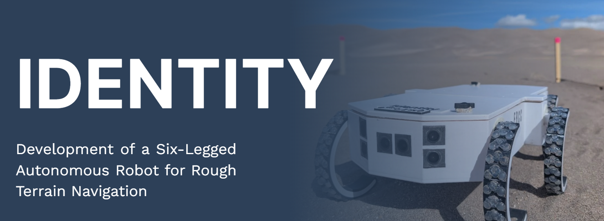

Identity is a six-legged autonomous rover built by Team Euler for the COSGC robotics challenge. It combines Python control software on a Raspberry Pi 3B+, Arduino/C++ sensor firmware on an Arduino Nano, six Feetech STS3215 servos, ultrasonic sensing, and IMU feedback to test low-cost rough-terrain locomotion.

The project explored whether a six-servo hexapod could adapt to rough outdoor terrain using a small set of interpretable gait parameters instead of complex multi-joint planning or learned locomotion. The key control variables were Buehler-clock duty cycle, impact window, phase offsets, and a global speed setpoint.

## Results At A Glance

| Metric | Result |
| --- | --- |
| Formal validation trials | 31/32 successful |
| Observed traversal success | 96.9% |
| Terrain categories | 7 |
| Simulation tests | 40/40 passing |
| Heart loop rate | 30 Hz |
| Sensor update rate | ~10 Hz |
| Steady-state servo load margin | At least 42% in formal trials |

The symposium paper treats the 32-trial validation set as a pilot study because the 95% confidence interval lower bound falls below 90%. Within that scope, the data support high observed traversal reliability across tile, carpet, packed earth, loose sand, gravel, stone fields, and 20-degree inclines.

## My Role

- Developed and tuned the Python gait/navigation stack, terrain overlays, telemetry analysis, simulation validation, and competition-readiness fixes.
- Programmed the Arduino/C++ sensor firmware for ultrasonic and IMU data collection.
- Integrated the sensor firmware with the Raspberry Pi control stack.
- Designed the CAD models, managed the 3D printing workflow, and selected the ordered hardware components.
- Contributed to electrical assembly, including soldering and wiring.

This repository contains the rover software, CAD references, validation media, and documentation for the Team Euler build.

## System Architecture


### Brain/Heart Process Split


The Brain process handles sensor interpretation, terrain classification, obstacle/cliff logic, and navigation state transitions. The Heart process runs the timing-critical gait loop, computes servo commands, applies safety governors, and keeps motor control isolated from slower navigation work.

## Key Engineering Decisions

- Kept each leg to one powered degree of freedom to reduce mechanical complexity and make the control system easier to audit.
- Used RHex-style C-shaped legs for rolling ground contact, passive compliance, and simple stance/swing timing.
- Split the software into Brain and Heart processes so navigation logic cannot block the 30 Hz gait loop.
- Offloaded ultrasonic timing and IMU polling to an Arduino Nano because Linux on the Raspberry Pi is not real time.
- Used Buehler-clock gait parameters rather than per-joint trajectory planning, keeping terrain adaptation interpretable.
- Built simulation tests for gait timing, terrain overlays, governors, and navigation FSM regressions before hardware deployment.

## Hardware Stack

| Subsystem | Components | Purpose |
| --- | --- | --- |
| Main compute | Raspberry Pi 3B+ | Runs the Python Brain/Heart control stack, navigation FSM, gait engine, telemetry handling, and simulation-derived safety logic |
| Sensor hub | Arduino Nano | Runs Arduino/C++ firmware for deterministic ultrasonic timing and IMU polling, then streams a 20-column CSV frame to the Raspberry Pi at ~10 Hz |
| Actuation | 6x Feetech STS3215 serial bus servos | One actuator per leg, commanded with synchronized bus writes for coordinated C-leg locomotion |
| Servo bus interface | FE-URT-1 debug board | Provides the serial interface used for Feetech servo configuration, calibration, and bus-level debugging |
| Obstacle and cliff sensing | 8x HC-SR04 ultrasonic sensors | Provides 360-degree obstacle coverage plus downward-facing cliff/drop-off detection |
| Orientation sensing | BNO085 IMU | Provides fused orientation for slope detection, rough-terrain classification, tip/fall safety logic, and navigation state decisions |
| Power | 3S 3000 mAh LiPo battery, 11.1 V nominal | Powers the rover with software brownout protection and speed limiting under voltage sag |
| Chassis | PETG 3D-printed octagonal body | Supports six servo modules with front/rear leg pairs splayed at 35 degrees and middle legs mounted perpendicular |
| Legs | C-shaped PETG arc legs, 125 mm effective radius, 195-degree arc span | RHex-style rolling contact geometry for single-actuator stance and swing phases |
| Ground contact | TPU rubber feet with staggered lug pattern | Improves traction on sand, gravel, stone, carpet, and packed earth |

### Measured Platform Geometry

- Body length: 511 mm
- Total width: 280 mm
- Static ground clearance: 74 mm
- Effective leg radius: 125 mm from servo shaft to outer contact surface
- Leg arc span: 195 degrees
- Estimated mass: 2 to 3 kg

### CAD Models

| Part | Onshape Link |
| --- | --- |
| Split lid | [Open model](https://cad.onshape.com/documents/4f3de965fea211f4280a3c9d/w/cdf7ccd18bab44fcea532f37/e/039c12e9b8634e9de48b237f) |
| Chassis | [Open model](https://cad.onshape.com/documents/b0cc0fb5d7d22bf167ea7f76/w/008ad764f5d31a5d18c51176/e/51bfb1e7ed0292f5d8418b8c) |
| C-leg | [Open model](https://cad.onshape.com/documents/da3a47429f3542b58cbfb9b8/w/d8b269a68f869584fe54d88e/e/9680572918098f7f67734634) |
| Leg adapters | [Open model](https://cad.onshape.com/documents/60e3d6ac247373a6c9d27099/w/3073c20af8fd58d7202c08cb/e/fac01f63525d9f291b8ab335) |

This hardware layout intentionally trades fine-grained foot placement for mechanical simplicity, passive compliance, and an auditable control model. The Arduino Nano isolates microsecond-sensitive sensor timing from the Raspberry Pi, while the Pi handles higher-level gait and navigation logic.

## Software Map

| File | Purpose | File | Purpose |
| --- | --- | --- | --- |
| `final_full_gait_test.py` | Main Python autonomous gait engine and navigation FSM | `offset_full_gait_test_v2.py` | Earlier v2 gait-engine implementation retained for comparison and development history |
| `final_full_gait_test_tripod_default.py` | Tripod-default final gait-engine variant for comparison and fallback testing | `home_tripod_wave_test.py` | Home test script for tripod and wave gait behavior |
| `final_sensors.ino` | Arduino/C++ Nano sensor firmware for ultrasonic and IMU data collection | `Detection_SensorHub_FINAL.ino` | Alternate final Arduino/C++ sensor-hub firmware variant |
| `fusion.py`, `fusion2.py` | Sensor interpretation and classification support | `input_thread.py`, `input_thread2.py` | Serial input handling |
| `auto_calibrate.py` | Automated setup and tuning calibration helper | `calibrate_homes.py` | Servo home-position calibration utility |
| `calibrate_legs.py` | Leg calibration utility for physical alignment | `validate_config.py` | Configuration validation before running the rover |
| `sim_verify.py` | Kinematic and gait-engine checks | `sim_terrain.py` | Terrain and governor stress scenarios |
| `sim_nav.py` | Navigation FSM tests with synthetic sensor frames | `monte_carlo_terrain.py` | Monte Carlo terrain simulation and robustness exploration |
| `rover_statics.py` | Static geometry/load analysis support | `gait_viz.py` | Gait visualization helper |
| `fsm_audit.py` | Navigation FSM audit/support script | `load_monitor.py` | Servo load monitoring support |
| `param_sweep.py` | Parameter sweep tooling for control tuning | `sweep_hz_governor.py` | Frequency/governor sweep analysis |
| `sweep_stall_threshold.py` | Stall-threshold sweep analysis | `parse_telemetry.py`, `analyze_run_log.py` | Telemetry and run-log analysis |
| `test_governor_ff_budget.py` | Feedforward/governor budget regression test | `test_nav_logic.py` | Navigation logic regression tests |
| `test_nav_serial.py` | Navigation serial-input regression tests | `test_sensor_classification.py` | Sensor classification regression tests |
| `rhex_cliff_research.txt` | RHex-style cliff/drop-off research notes | `.gitignore` | Repository ignore rules |

## Gait Control

The gait engine follows a RHex-style Buehler clock. Duty cycle defines stance fraction, phase offsets define inter-leg timing, and a global speed setpoint controls phase progression.

| Gait | Duty Cycle | Primary Use |
| --- | --- | --- |
| Tripod | 0.5 | Faster locomotion on flat and moderate terrain |
| Wave | 0.75 | Higher-contact gait for rough terrain and inclines |
| Quadruped | 0.7 | Balance of stability and speed |

### Gait Pattern Visuals

The diagrams below show the servo grouping and top-view leg order used by the implemented gait modes.

| Tripod | Quadruped | Wave |
| --- | --- | --- |
|  |  |  |

Terrain overlays adjust gait choice, impact window, duty cycle, and speed for flat ground, rough terrain, deep sand, and incline traversal. A phase-error governor reduces speed when commanded and measured servo phase diverge beyond the threshold used in the validation work.

## Navigation And Terrain Adaptation

The autonomous navigation layer uses an eight-state finite state machine for forward traversal, slow approach, arc turns, backing up, pivot turns, recovery wiggle, and safe stop behavior. Sensor input comes from ultrasonic range data, IMU orientation, servo telemetry, and watchdog state.


### Terrain Classification

| Signal | Used For |
| --- | --- |
| IMU pitch | Incline and descent detection |
| Angular-rate and ultrasonic stability | Rough-terrain classification |
| Sustained servo load | Deep-sand detection |
| Downward ultrasonic distance changes | Cliff/drop-off detection |


### Servo Load Margin

Across the validation terrain set, measured servo loads stayed below the configured stall threshold.

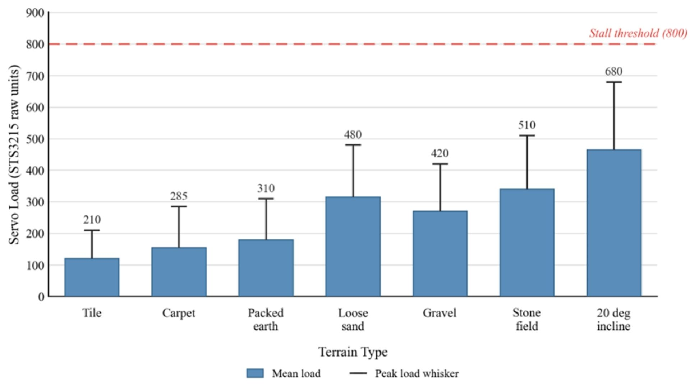

### Field Demo Videos

| Demo | Preview |
| --- | --- |
| Loose Sand Hill Traversal | [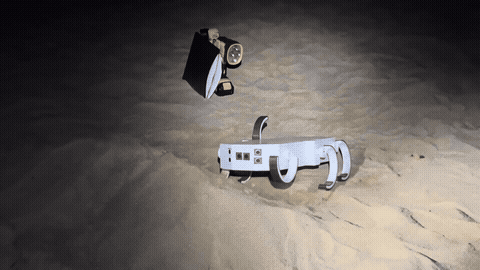](https://github.com/Robiswell/Euler_Rover_2026/blob/main/docs/assets/sand-hill-traversal.mp4) |
| Daytime Sand Hill Traversal | [](https://github.com/Robiswell/Euler_Rover_2026/blob/main/docs/assets/daytime-hill-traversal.mp4) |
| Cliff Detection Behavior | [](https://github.com/Robiswell/Euler_Rover_2026/blob/main/docs/assets/cliff-detection-demo.mp4) |
| Indoor Obstacle Navigation | [](https://github.com/Robiswell/Euler_Rover_2026/blob/main/docs/assets/indoor-obstacle-navigation-demo.mp4) |
| Park Concrete Table Seating Navigation | [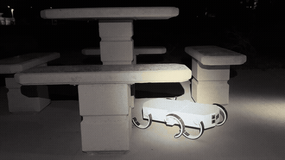](https://github.com/Robiswell/Euler_Rover_2026/blob/main/docs/assets/navigation-park-table-seating.mp4) |

### Course Success Runs

| Run | Preview |
| --- | --- |
| Course 1 Success | [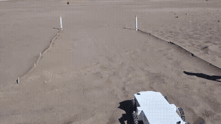](https://github.com/Robiswell/Euler_Rover_2026/blob/main/docs/assets/course-1-success.mp4) |
| Course 2 Success | [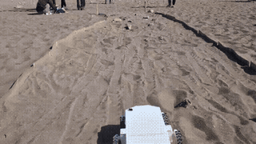](https://github.com/Robiswell/Euler_Rover_2026/blob/main/docs/assets/course-2-success.mp4) |
| Course 3 Success | [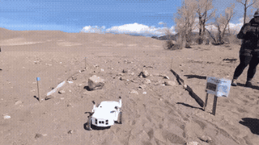](https://github.com/Robiswell/Euler_Rover_2026/blob/main/docs/assets/course-3-success.mp4) |
| Course 4 Success | [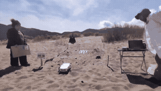](https://github.com/Robiswell/Euler_Rover_2026/blob/main/docs/assets/course-4-success.mp4) |
| Course 5 Success | [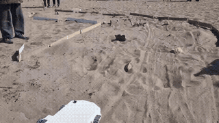](https://github.com/Robiswell/Euler_Rover_2026/blob/main/docs/assets/course-5-success.mp4) |
| Challenge Course Success | [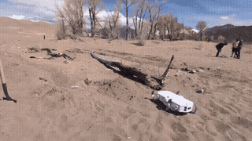](https://github.com/Robiswell/Euler_Rover_2026/blob/main/docs/assets/challenge-course-success.mp4) |

The [Final Post-Competition Build](https://github.com/Robiswell/Euler_Rover_2026/releases/tag/final-post-competition-build) restores cliff detection after the competition snapshot had it disabled during troubleshooting.

## Simulation And Testing

The simulation framework contains 40 automated checks:

- 14 kinematic and gait checks in `sim_verify.py`
- 14 terrain and governor scenarios in `sim_terrain.py`
- 12 navigation FSM categories in `sim_nav.py`

At the time of the symposium paper, the full suite passed 40/40 checks. The simulation validates timing, state transitions, terrain overlays, and control invariants, but it does not model all physical effects such as compliance, backlash, or deformable terrain.

Run the simulation checks:

```bash
python3 sim_verify.py
python3 sim_terrain.py
python3 sim_nav.py
```

## Releases

- [Final Post-Competition Build](https://github.com/Robiswell/Euler_Rover_2026/releases/tag/final-post-competition-build): cleaned public final build after the COSGC competition, with cliff detection turned back on.
- [Competition Build](https://github.com/Robiswell/Euler_Rover_2026/releases/tag/Competition): competition snapshot used during the event.
- [V0.5 Full Program](https://github.com/Robiswell/Euler_Rover_2026/releases/tag/pre-release): earlier autonomous rover milestone.

## Demo Videos

- [Sand Hill Traversal Run](https://github.com/Robiswell/Euler_Rover_2026/blob/main/docs/assets/sand-hill-traversal.mp4)
- [Daytime Sand Hill Traversal Run](https://github.com/Robiswell/Euler_Rover_2026/blob/main/docs/assets/daytime-hill-traversal.mp4)
- [Cliff Detection Demo](https://github.com/Robiswell/Euler_Rover_2026/blob/main/docs/assets/cliff-detection-demo.mp4)
- [Indoor Obstacle Navigation Run](https://github.com/Robiswell/Euler_Rover_2026/blob/main/docs/assets/indoor-obstacle-navigation-demo.mp4)
- [Park Concrete Table Seating Navigation Run](https://github.com/Robiswell/Euler_Rover_2026/blob/main/docs/assets/navigation-park-table-seating.mp4)
- [Home Tripod Wave Test](https://youtube.com/shorts/x6369QqBHbY?feature=share)
- [Full Gait Test 3/5/26](https://youtu.be/S6lwZjQxPko)

## Challenge Success Videos

- [Course 1 Success](https://github.com/Robiswell/Euler_Rover_2026/blob/main/docs/assets/course-1-success.mp4)
- [Course 2 Success](https://github.com/Robiswell/Euler_Rover_2026/blob/main/docs/assets/course-2-success.mp4)
- [Course 3 Success](https://github.com/Robiswell/Euler_Rover_2026/blob/main/docs/assets/course-3-success.mp4)
- [Course 4 Success](https://github.com/Robiswell/Euler_Rover_2026/blob/main/docs/assets/course-4-success.mp4)
- [Course 5 Success](https://github.com/Robiswell/Euler_Rover_2026/blob/main/docs/assets/course-5-success.mp4)
- [Challenge Course Success](https://github.com/Robiswell/Euler_Rover_2026/blob/main/docs/assets/challenge-course-success.mp4)

## Limitations

- The 32-trial validation set is best treated as a pilot study, not a fully powered statistical proof.
- Exact per-trial software hashes were not preserved during the late-stage validation period.
- The simulation framework does not model mechanical compliance, backlash, or deformable terrain.
- The clearest remaining failure mode was abrupt terrain transition within a single stride.
- Search-and-rescue and planetary robotics are future application targets, not demonstrated deployment domains.

## Summary

Built and validated a six-legged autonomous rover spanning Python-based Raspberry Pi control, Arduino/C++ sensor firmware, CAD-modeled and 3D-printed mechanical parts, selected hardware components, terrain-adaptive gait overlays, Brain/Heart process architecture, and simulation-backed navigation tests. Formal field validation showed 31/32 successful traversals across seven terrain categories.

## Repository Status

Hardware operation requires calibrated servos, connected sensor firmware, and safety checks before powering the robot.

## Colorado Space Grant Consortium Research Symposium Submissions

| Submission | Link |
| --- | --- |
| Paper | [Development of a Six-Legged Autonomous Robot for Rough Terrain Navigation Paper](docs/paper/development-of-six-legged-autonomous-robot-frcc.pdf) |
| Presentation Slides | [Development of a Six-Legged Autonomous Robot for Rough Terrain Navigation Paper Presentation Slides](docs/paper/development-of-six-legged-autonomous-robot-frcc-presentation-slides.pdf) |
| Poster | [Development of a Six-Legged Autonomous Robot for Rough Terrain Navigation Poster (2026 Best Robotics Poster)](docs/paper/development-of-six-legged-autonomous-robot-frcc-poster.pdf) |
| Video | [Identity COSGC Video (2026 People's Choice Video)](https://github.com/Robiswell/Euler_Rover_2026/blob/main/docs/assets/identity-cosgc-2026-award-video.mp4)<br><br>[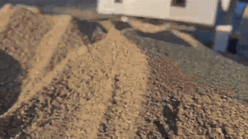](https://github.com/Robiswell/Euler_Rover_2026/blob/main/docs/assets/identity-cosgc-2026-award-video.mp4) |
