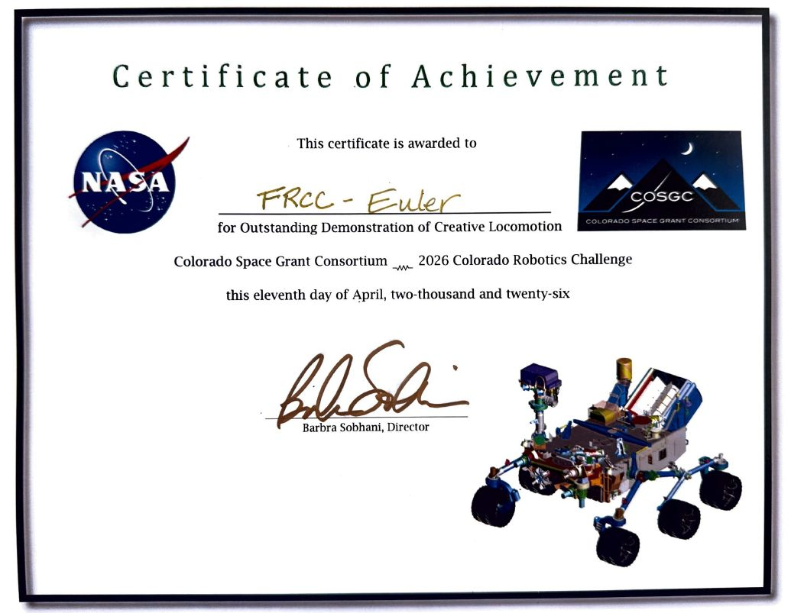
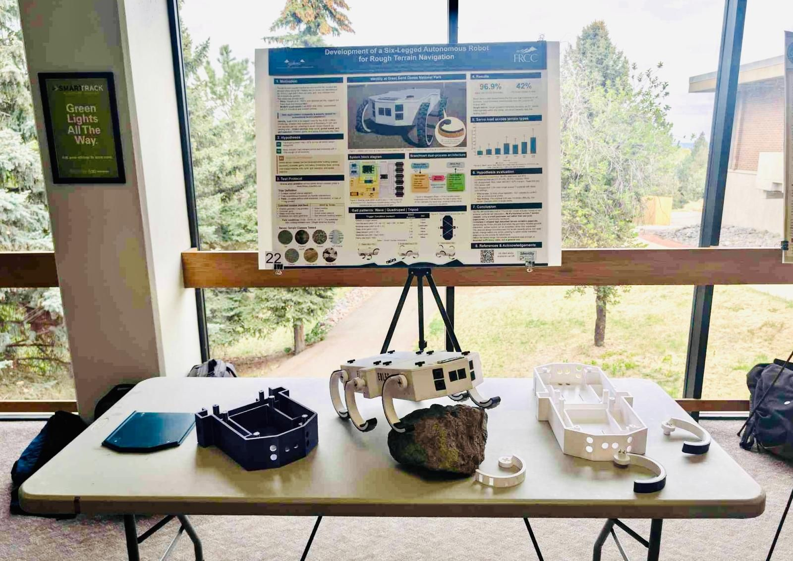
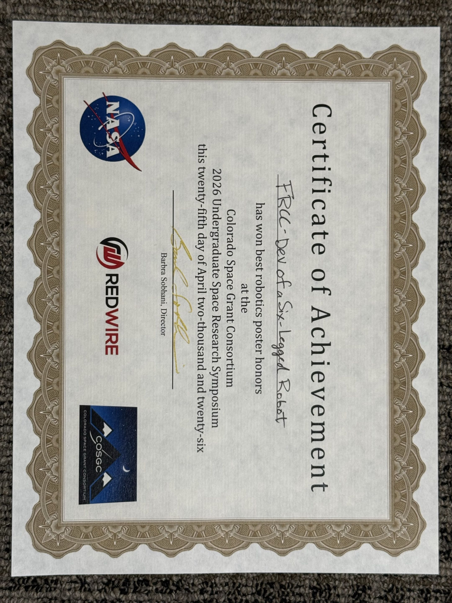
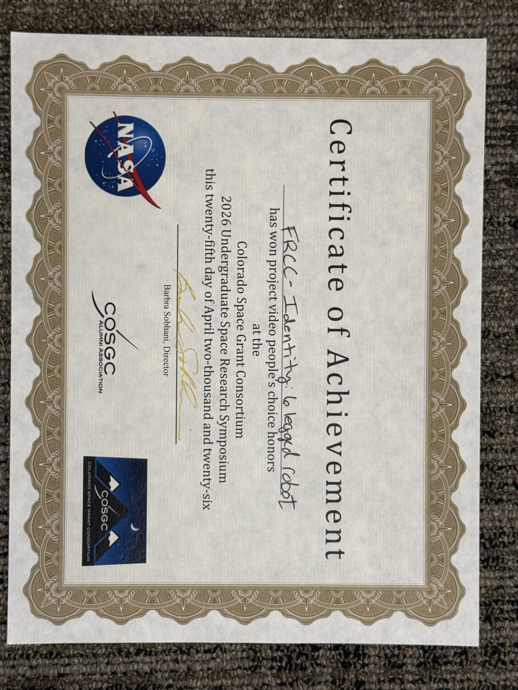

# Identity: Team Euler Autonomous Hexapod Rover


[](https://github.com/Robiswell/Euler_Rover_2026/actions/workflows/simulation.yml)
[](final_full_gait_test.py)
[](final_sensors.ino)
[](LICENSE)

Identity is a six-legged autonomous rover built by Team Euler for the COSGC robotics challenge. It combines Python control software on a Raspberry Pi 3B+, Arduino/C++ sensor firmware on an Arduino Nano, six Feetech STS3215 servos, ultrasonic sensing, and IMU feedback to test low-cost rough-terrain locomotion.

The project explored whether a six-servo hexapod could adapt to rough outdoor terrain using a small set of interpretable gait parameters instead of complex multi-joint planning or learned locomotion. The key control variables were Buehler-clock duty cycle, impact window, phase offsets, and a global speed setpoint.

The final build combined field-tested hardware, simulation-backed control logic, and documented validation results showing 31/32 successful traversals across seven terrain categories.

## Quick Reviewer Path

| Start Here | Why It Matters |
| --- | --- |
| [`final_full_gait_test.py`](final_full_gait_test.py) | Main Raspberry Pi/Python gait, navigation, terrain overlay, and safety-governor program |
| [`final_sensors.ino`](final_sensors.ino) | Arduino/C++ sensor firmware for ultrasonic and IMU data collection |
| [Simulation Checks](https://github.com/Robiswell/Euler_Rover_2026/actions/workflows/simulation.yml) | Passing gait, terrain, navigation, and pytest regression checks |
| [Field Demo Videos](#field-demo-videos) | Clickable GIF previews linking to full rover traversal videos |
| [Research Symposium Submissions](#colorado-space-grant-consortium-research-symposium-submissions) | Paper, poster, presentation slides, award video, and symposium documentation |

## Table Of Contents

- [Quick Reviewer Path](#quick-reviewer-path)
- [Results At A Glance](#results-at-a-glance)
- [Repository Status](#repository-status)
- [My Role](#my-role)
- [System Architecture](#system-architecture)
- [Key Engineering Decisions](#key-engineering-decisions)
- [Hardware Stack](#hardware-stack)
  - [Build Components](#build-components)
  - [Measured Platform Geometry](#measured-platform-geometry)
  - [CAD Models](#cad-models)
- [Software Map](#software-map)
  - [Main Program Modes](#main-program-modes)
- [Gait Control](#gait-control)
- [Navigation And Terrain Adaptation](#navigation-and-terrain-adaptation)
  - [Field Demo Videos](#field-demo-videos)
  - [Course Success Runs](#course-success-runs)
- [Colorado Space Grant Consortium Robotics Challenge Award](#colorado-space-grant-consortium-robotics-challenge-award)
- [Simulation And Testing](#simulation-and-testing)
- [Releases](#releases)
- [Known Limits](#known-limits)
- [Colorado Space Grant Consortium Research Symposium Submissions](#colorado-space-grant-consortium-research-symposium-submissions)
  - [Symposium Poster Presentation](#symposium-poster-presentation)
  - [Symposium Awards](#symposium-awards)

## Results At A Glance

| Metric | Result |
| --- | --- |
| Formal validation trials | 31/32 successful |
| Observed traversal success | 96.9% |
| Terrain categories | 7 |
| Simulation tests | 40/40 passing |
| Awards | 3 COSGC recognitions: Outstanding Demonstration of Creative Locomotion, Best Robotics Poster, and People's Choice Video |
| Heart loop rate | 30 Hz |
| Sensor update rate | ~10 Hz |
| Steady-state servo load margin | At least 42% in formal trials |

The symposium paper treats the 32-trial validation set as a pilot study because the 95% confidence interval lower bound falls below 90%. Within that scope, the data support high observed traversal reliability across tile, carpet, packed earth, loose sand, gravel, stone fields, and 20-degree inclines.

## Repository Status

This repository contains the final public code, validation previews, CAD references, release links, and documentation for the Team Euler rover build. Full-resolution videos and symposium PDFs are hosted in the [Portfolio Media Assets](https://github.com/Robiswell/Euler_Rover_2026/releases/tag/media-assets) release to keep the repository lightweight.

| Area | Status |
| --- | --- |
| Main rover program | Final post-competition build is published, with cliff detection restored after the competition troubleshooting snapshot |
| Validated release history | Release links preserve the final post-competition, competition, and earlier autonomous rover milestones |
| Simulation coverage | 40/40 checks passing at the symposium-paper checkpoint; [GitHub Actions](https://github.com/Robiswell/Euler_Rover_2026/actions/workflows/simulation.yml) runs the simulation suite and pytest regressions on code/firmware/dependency changes, pull request, and manual dispatch |
| Setup documentation | `RUNNING.md`, `ARCHITECTURE.md`, and `requirements.txt` document setup, runtime modes, and software structure |
| Hardware operation | Requires calibrated servos, connected Arduino sensor firmware, and pre-run safety checks before powering the rover |
| Documentation included | README includes system architecture, software map, CAD links, field demos, course success videos, paper/poster links, and award documentation |
| License | PolyForm Noncommercial 1.0.0; commercial use requires separate permission |
| Known limits | Simulation does not fully model compliance, backlash, or deformable terrain; abrupt terrain transitions remained the clearest unresolved risk |

## My Role

- Developed and tuned the Python gait/navigation stack, terrain overlays, telemetry analysis, simulation validation, and competition-readiness fixes.
- Programmed the Arduino/C++ sensor firmware for ultrasonic and IMU data collection.
- Integrated the sensor firmware with the Raspberry Pi control stack.
- Designed the CAD models, managed the 3D printing workflow, and selected the ordered hardware components.
- Contributed to electrical assembly, including soldering and wiring.

## System Architecture


See [`ARCHITECTURE.md`](ARCHITECTURE.md) for the full software architecture map, including the Brain/Heart process split, sensor pipeline, terrain overlay, safety governors, and simulation coverage.

### Brain/Heart Process Split


The Brain process handles sensor interpretation, terrain classification, obstacle/cliff logic, and navigation state transitions. The Heart process runs the timing-critical gait loop, computes servo commands, applies safety governors, and keeps motor control isolated from slower navigation work.

## Key Engineering Decisions

- Kept each leg to one powered degree of freedom to reduce mechanical complexity and make the control system easier to audit.
- Used RHex-style C-shaped legs for rolling ground contact, passive compliance, and simple stance/swing timing.
- Split the software into Brain and Heart processes so navigation logic cannot block the 30 Hz gait loop.
- Offloaded ultrasonic timing and IMU polling to an Arduino Nano because Linux on the Raspberry Pi is not real time.
- Used Buehler-clock gait parameters rather than per-joint trajectory planning, keeping terrain adaptation interpretable.
- Built simulation tests for gait timing, terrain overlays, governors, and navigation FSM regressions before hardware deployment.

## Hardware Stack

| Subsystem | Components | Purpose |
| --- | --- | --- |
| Main compute | Raspberry Pi 3B+ | Runs the Python Brain/Heart control stack, navigation FSM, gait engine, telemetry handling, and simulation-derived safety logic |
| Sensor hub | Arduino Nano | Runs Arduino/C++ firmware for deterministic ultrasonic timing and IMU polling, then streams a 20-column CSV frame to the Raspberry Pi at ~10 Hz |
| Actuation | 6x Feetech STS3215 serial bus servos | One actuator per leg, commanded with synchronized bus writes for coordinated C-leg locomotion |
| Servo bus interface | FE-URT-1 debug board | Provides the serial interface used for Feetech servo configuration, calibration, and bus-level debugging |
| Obstacle and cliff sensing | 8x HC-SR04 ultrasonic sensors | Provides 360-degree obstacle coverage plus downward-facing cliff/drop-off detection |
| Orientation sensing | BNO085 IMU | Provides fused orientation for slope detection, rough-terrain classification, tip/fall safety logic, and navigation state decisions |
| Power | 3S 3000 mAh LiPo battery, 11.1 V nominal | Powers the rover with software brownout protection and speed limiting under voltage sag |
| Chassis | PETG 3D-printed octagonal body | Supports six servo modules with front/rear leg pairs splayed at 35 degrees and middle legs mounted perpendicular |
| Legs | C-shaped PETG arc legs, 125 mm effective radius, 195-degree arc span | RHex-style rolling contact geometry for single-actuator stance and swing phases |
| Ground contact | TPU rubber feet with staggered lug pattern | Improves traction on sand, gravel, stone, carpet, and packed earth |

### Build Components

| Component | Quantity | Integration Notes |
| --- | ---: | --- |
| Raspberry Pi 3B+ | 1 | Main onboard computer for Python navigation, gait control, telemetry, and simulation-derived safety logic |
| Arduino Nano | 1 | Dedicated sensor hub for deterministic ultrasonic timing and BNO085 polling |
| Feetech STS3215 serial bus servos | 6 | One actuator per C-leg, driven through synchronized bus commands |
| FE-URT-1 debug board | 1 | Feetech servo configuration, calibration, and serial bus debugging interface |
| HC-SR04 ultrasonic sensors | 8 | Forward, side, rear, and downward cliff/drop-off distance sensing |
| BNO085 IMU | 1 | Fused orientation for slope detection, terrain classification, and tip/fall logic |
| 3S 3000 mAh LiPo battery | 1 | Main rover power source with software limits for voltage-sag protection |
| PETG printed chassis, split lid, and C-leg assemblies | Custom set | CAD-modeled and 3D-printed rover structure, including octagonal body and single-actuator leg geometry |
| TPU traction feet | 6 leg contact sets | Flexible lugged contact surface for sand, gravel, carpet, stone, and packed earth |
| Wiring, soldered sensor harnesses, and mounting hardware | Rover-specific | Electrical assembly and mechanical fastening for sensors, compute boards, servo bus, and power distribution |

### Measured Platform Geometry

- Body length: 511 mm
- Total width: 280 mm
- Static ground clearance: 74 mm
- Effective leg radius: 125 mm from servo shaft to outer contact surface
- Leg arc span: 195 degrees
- Estimated mass: 2 to 3 kg

### CAD Models

| Part | Onshape Link |
| --- | --- |
| Split lid | [Open model](https://cad.onshape.com/documents/4f3de965fea211f4280a3c9d/w/cdf7ccd18bab44fcea532f37/e/039c12e9b8634e9de48b237f) |
| Chassis | [Open model](https://cad.onshape.com/documents/b0cc0fb5d7d22bf167ea7f76/w/008ad764f5d31a5d18c51176/e/51bfb1e7ed0292f5d8418b8c) |
| C-leg | [Open model](https://cad.onshape.com/documents/da3a47429f3542b58cbfb9b8/w/d8b269a68f869584fe54d88e/e/9680572918098f7f67734634) |
| Leg adapters | [Open model](https://cad.onshape.com/documents/60e3d6ac247373a6c9d27099/w/3073c20af8fd58d7202c08cb/e/fac01f63525d9f291b8ab335) |

This hardware layout intentionally trades fine-grained foot placement for mechanical simplicity, passive compliance, and an auditable control model. The Arduino Nano isolates microsecond-sensitive sensor timing from the Raspberry Pi, while the Pi handles higher-level gait and navigation logic.

## Software Map

The source files are grouped by runtime role below. See [`RUNNING.md`](RUNNING.md) for setup and command examples; calibration, telemetry, tuning, and regression helpers are listed separately so reviewers can distinguish active runtime code from support tooling.

### Runtime And Gait Control

| File | Purpose |
| --- | --- |
| `final_full_gait_test.py` | Main Python autonomous gait engine and navigation FSM |
| `offset_full_gait_test_v2.py` | Earlier v2 gait-engine implementation retained for comparison and development history |
| `final_full_gait_test_tripod_default.py` | Tripod-default final gait-engine variant for comparison and fallback testing |
| `home_tripod_wave_test.py` | Legs-home sequence followed by forward tripod and forward wave gait checks |

### Main Program Modes

`final_full_gait_test.py` supports several launch modes for hardware runs, dry runs, and subsystem checks:

- `sudo python3 final_full_gait_test.py`: full maneuver demo across the implemented gaits and stance behaviors.
- `sudo python3 final_full_gait_test.py --competition`: autonomous navigation with the eight-state FSM, Arduino sensor stream, terrain adaptation, and live terminal state output.
- `sudo python3 final_full_gait_test.py --competition-dry-run`: autonomous navigation logic with sensors active and servo speed held at zero.
- `sudo python3 final_full_gait_test.py --test-competition`: timed fallback sequence with no sensor dependency.
- `sudo python3 final_full_gait_test.py --test-tripod`, `--test-quad`, or `--test-wave`: gait-specific forward, turning, pivot, and reverse checks.
- `sudo python3 final_full_gait_test.py --test-recovery`: recovery wiggle and self-right behavior checks.
- `sudo python3 final_full_gait_test.py --test-arduino`, `--test-sensors`, or `--test-nav`: Arduino serial, sensor-processing, and full navigation-pipeline diagnostics.
- `sudo python3 final_full_gait_test.py --drift-test <gait>`: heading-drift measurement for gait tuning.
- `--no-verbose-telemetry`: optional logging flag for reducing extended servo, sensor, and navigation output.

### Sensor Firmware And Input

| File | Purpose |
| --- | --- |
| `final_sensors.ino` | Arduino/C++ Nano sensor firmware for ultrasonic and IMU data collection |
| `Detection_SensorHub_FINAL.ino` | Alternate final Arduino/C++ sensor-hub firmware variant |
| `fusion.py`, `fusion2.py` | Sensor interpretation and classification support |
| `input_thread.py`, `input_thread2.py` | Serial input handling |

### Calibration And Configuration

| File | Purpose |
| --- | --- |
| `auto_calibrate.py` | Automated setup and tuning calibration helper |
| `calibrate_homes.py` | Servo home-position calibration utility |
| `calibrate_legs.py` | Leg calibration utility for physical alignment |
| `validate_config.py` | Configuration validation before running the rover |

### Simulation And Verification

| File | Purpose |
| --- | --- |
| `sim_verify.py` | Kinematic and gait-engine checks |
| `sim_terrain.py` | Terrain and governor stress scenarios |
| `sim_nav.py` | Navigation FSM tests with synthetic sensor frames |
| `monte_carlo_terrain.py` | Monte Carlo terrain simulation and robustness exploration |

### Analysis And Tuning

| File | Purpose |
| --- | --- |
| `rover_statics.py` | Static geometry/load analysis support |
| `gait_viz.py` | Gait visualization helper |
| `fsm_audit.py` | Navigation FSM audit/support script |
| `load_monitor.py` | Servo load monitoring support |
| `param_sweep.py` | Parameter sweep tooling for control tuning |
| `sweep_hz_governor.py` | Frequency/governor sweep analysis |
| `sweep_stall_threshold.py` | Stall-threshold sweep analysis |
| `parse_telemetry.py`, `analyze_run_log.py` | Telemetry and run-log analysis |

### Regression Tests And Notes

| File | Purpose |
| --- | --- |
| `test_governor_ff_budget.py` | Feedforward/governor budget regression test |
| `test_nav_logic.py` | Navigation logic regression tests |
| `test_nav_serial.py` | Navigation serial-input regression tests |
| `test_sensor_classification.py` | Sensor classification regression tests |
| `rhex_cliff_research.txt` | RHex-style cliff/drop-off research notes |
| `.gitignore` | Repository ignore rules |

## Gait Control

The gait engine follows a RHex-style Buehler clock. Duty cycle defines stance fraction, phase offsets define inter-leg timing, and a global speed setpoint controls phase progression.

| Gait | Duty Cycle | Primary Use |
| --- | --- | --- |
| Tripod | 0.5 | Faster locomotion on flat and moderate terrain |
| Wave | 0.75 | Higher-contact gait for rough terrain and inclines |
| Quadruped | 0.7 | Balance of stability and speed |

### Gait Pattern Visuals

The diagrams below show the servo grouping and top-view leg order used by the implemented gait modes.

| Tripod | Quadruped | Wave |
| --- | --- | --- |
|  |  |  |

Terrain overlays adjust gait choice, impact window, duty cycle, and speed for flat ground, rough terrain, deep sand, and incline traversal. A phase-error governor reduces speed when commanded and measured servo phase diverge beyond the threshold used in the validation work.

## Navigation And Terrain Adaptation

The autonomous navigation layer uses an eight-state finite state machine for forward traversal, slow approach, arc turns, backing up, pivot turns, recovery wiggle, and safe stop behavior. Sensor input comes from ultrasonic range data, IMU orientation, servo telemetry, and watchdog state.


### Terrain Classification

| Signal | Used For |
| --- | --- |
| IMU pitch | Incline and descent detection |
| Angular-rate and ultrasonic stability | Rough-terrain classification |
| Sustained servo load | Deep-sand detection |
| Downward ultrasonic distance changes | Cliff/drop-off detection |


### Servo Load Margin

Across the validation terrain set, measured servo loads stayed below the configured stall threshold.


### Field Demo Videos

<table width="100%">
  <tr>
    <th width="260">Demo</th>
    <th>Preview</th>
  </tr>
  <tr>
    <td><a href="https://github.com/Robiswell/Euler_Rover_2026/releases/download/media-assets/sand-hill-traversal.mp4">Loose Sand Hill Traversal</a></td>
    <td><a href="https://github.com/Robiswell/Euler_Rover_2026/releases/download/media-assets/sand-hill-traversal.mp4"></a></td>
  </tr>
  <tr>
    <td><a href="https://github.com/Robiswell/Euler_Rover_2026/releases/download/media-assets/daytime-hill-traversal.mp4">Daytime Sand Hill Traversal</a></td>
    <td><a href="https://github.com/Robiswell/Euler_Rover_2026/releases/download/media-assets/daytime-hill-traversal.mp4"></a></td>
  </tr>
  <tr>
    <td><a href="https://github.com/Robiswell/Euler_Rover_2026/releases/download/media-assets/cliff-detection-demo.mp4">Cliff Detection Behavior</a></td>
    <td><a href="https://github.com/Robiswell/Euler_Rover_2026/releases/download/media-assets/cliff-detection-demo.mp4"></a></td>
  </tr>
  <tr>
    <td><a href="https://github.com/Robiswell/Euler_Rover_2026/releases/download/media-assets/indoor-obstacle-navigation-demo.mp4">Indoor Obstacle Navigation</a></td>
    <td><a href="https://github.com/Robiswell/Euler_Rover_2026/releases/download/media-assets/indoor-obstacle-navigation-demo.mp4"></a></td>
  </tr>
  <tr>
    <td><a href="https://github.com/Robiswell/Euler_Rover_2026/releases/download/media-assets/navigation-park-table-seating.mp4">Park Concrete Table Seating Navigation</a></td>
    <td><a href="https://github.com/Robiswell/Euler_Rover_2026/releases/download/media-assets/navigation-park-table-seating.mp4"></a></td>
  </tr>
</table>

### Course Success Runs

<table width="100%">
  <tr>
    <th width="260">Run</th>
    <th>Preview</th>
  </tr>
  <tr>
    <td><a href="https://github.com/Robiswell/Euler_Rover_2026/releases/download/media-assets/course-1-success.mp4">Course 1 Success</a></td>
    <td><a href="https://github.com/Robiswell/Euler_Rover_2026/releases/download/media-assets/course-1-success.mp4"></a></td>
  </tr>
  <tr>
    <td><a href="https://github.com/Robiswell/Euler_Rover_2026/releases/download/media-assets/course-2-success.mp4">Course 2 Success</a></td>
    <td><a href="https://github.com/Robiswell/Euler_Rover_2026/releases/download/media-assets/course-2-success.mp4"></a></td>
  </tr>
  <tr>
    <td><a href="https://github.com/Robiswell/Euler_Rover_2026/releases/download/media-assets/course-3-success.mp4">Course 3 Success</a></td>
    <td><a href="https://github.com/Robiswell/Euler_Rover_2026/releases/download/media-assets/course-3-success.mp4"></a></td>
  </tr>
  <tr>
    <td><a href="https://github.com/Robiswell/Euler_Rover_2026/releases/download/media-assets/course-4-success.mp4">Course 4 Success</a></td>
    <td><a href="https://github.com/Robiswell/Euler_Rover_2026/releases/download/media-assets/course-4-success.mp4"></a></td>
  </tr>
  <tr>
    <td><a href="https://github.com/Robiswell/Euler_Rover_2026/releases/download/media-assets/course-5-success.mp4">Course 5 Success</a></td>
    <td><a href="https://github.com/Robiswell/Euler_Rover_2026/releases/download/media-assets/course-5-success.mp4"></a></td>
  </tr>
  <tr>
    <td><a href="https://github.com/Robiswell/Euler_Rover_2026/releases/download/media-assets/challenge-course-success.mp4">Challenge Course Success</a></td>
    <td><a href="https://github.com/Robiswell/Euler_Rover_2026/releases/download/media-assets/challenge-course-success.mp4"></a></td>
  </tr>
</table>

## Colorado Space Grant Consortium Robotics Challenge Award

<table>
  <tr>
    <td width="58%"></td>
    <td>
      <strong>Outstanding Demonstration of Creative Locomotion</strong><br><br>
      Awarded at the 2026 Colorado Space Grant Consortium Robotics Challenge for the rover's six-legged C-leg locomotion approach.
    </td>
  </tr>
</table>

The [Final Post-Competition Build](https://github.com/Robiswell/Euler_Rover_2026/releases/tag/final-post-competition-build) restores cliff detection after the competition snapshot had it disabled during troubleshooting.

## Simulation And Testing

The simulation framework contains 40 automated checks:

- 14 kinematic and gait checks in `sim_verify.py`
- 14 terrain and governor scenarios in `sim_terrain.py`
- 12 navigation FSM categories in `sim_nav.py`

At the time of the symposium paper, the full suite passed 40/40 checks. The simulation validates timing, state transitions, terrain overlays, and control invariants, but it does not model all physical effects such as compliance, backlash, or deformable terrain.

[GitHub Actions](https://github.com/Robiswell/Euler_Rover_2026/actions/workflows/simulation.yml) runs these simulation checks and the pytest regression suite on code, firmware, dependency, workflow, pull request, and manual-dispatch events.

Run the simulation checks:

```bash
python3 sim_verify.py
python3 sim_terrain.py
python3 sim_nav.py
```

## Releases

- [Final Post-Competition Build](https://github.com/Robiswell/Euler_Rover_2026/releases/tag/final-post-competition-build): final public build after the COSGC competition, with cliff detection turned back on.
- [Competition Build](https://github.com/Robiswell/Euler_Rover_2026/releases/tag/Competition): competition snapshot used during the event.
- [V0.5 Full Program](https://github.com/Robiswell/Euler_Rover_2026/releases/tag/pre-release): earlier autonomous rover milestone.

## Known Limits

- The 32-trial validation set supports pilot-scale reliability claims, not a fully powered statistical proof.
- Late-stage validation did not preserve exact per-trial software hashes.
- The simulation framework does not model mechanical compliance, backlash, or deformable terrain.
- The clearest remaining failure mode was abrupt terrain transition within a single stride.
- Search-and-rescue and planetary robotics are future application targets, not demonstrated deployment domains.

## Colorado Space Grant Consortium Research Symposium Submissions

| Submission | Link |
| --- | --- |
| Paper | [Development of a Six-Legged Autonomous Robot for Rough Terrain Navigation Paper](https://github.com/Robiswell/Euler_Rover_2026/releases/download/media-assets/development-of-six-legged-autonomous-robot-frcc.pdf) |
| Presentation Slides | [Development of a Six-Legged Autonomous Robot for Rough Terrain Navigation Paper Presentation Slides](https://github.com/Robiswell/Euler_Rover_2026/releases/download/media-assets/development-of-six-legged-autonomous-robot-frcc-presentation-slides.pdf) |
| Poster | [Development of a Six-Legged Autonomous Robot for Rough Terrain Navigation Poster (2026 Best Robotics Poster)](https://github.com/Robiswell/Euler_Rover_2026/releases/download/media-assets/development-of-six-legged-autonomous-robot-frcc-poster.pdf) |
| Video | [Identity COSGC Video (2026 People's Choice Video)](https://github.com/Robiswell/Euler_Rover_2026/releases/download/media-assets/identity-cosgc-2026-award-video.mp4)<br><br>[](https://github.com/Robiswell/Euler_Rover_2026/releases/download/media-assets/identity-cosgc-2026-award-video.mp4) |

### Symposium Poster Presentation

<table>
  <tr>
    <td width="58%"></td>
    <td>
      <strong>2026 NASA Colorado Space Grant Consortium Research Symposium Display</strong><br><br>
      Presented the rover prototype, printed CAD components, and research poster together so reviewers could connect the software, mechanical design, and validation results.
    </td>
  </tr>
</table>

### Symposium Awards

<table>
  <tr>
    <td align="center"><strong>2026 Best Robotics Poster</strong></td>
    <td align="center"><strong>2026 People's Choice Video</strong></td>
  </tr>
  <tr>
    <td></td>
    <td></td>
  </tr>
</table>
