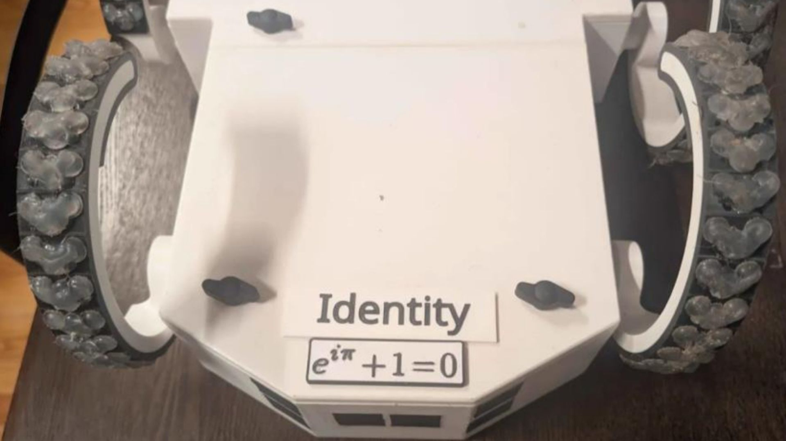

# Bill of Materials

This categorized BOM summarizes the exported source sheet in [`purchasing-bom.csv`](purchasing-bom.csv). Quantities are ordered package counts, so multi-packs list the package count while notes describe how the parts were used on the rover.

## At A Glance

<table>
  <tr>
    <th>Purchase Lines</th>
    <th>Locomotion Core</th>
    <th>Sensor Coverage</th>
    <th>Fabrication Stack</th>
  </tr>
  <tr>
    <td align="center"><strong>31</strong> tracked source items</td>
    <td align="center"><strong>6</strong> STS3215 C-leg servos</td>
    <td align="center"><strong>8</strong> ultrasonic sensors plus BNO085 IMU</td>
    <td align="center"><strong>PETG + TPU</strong> with bumper-pad V tread</td>
  </tr>
</table>

## Control, Actuation, And Sensing

| Purchased Item | Ordered Qty | Integration Role |
| --- | ---: | --- |
| [Raspberry Pi Model 3B 1GB](https://www.digikey.com/en/products/detail/raspberry-pi/SC0022/6152799) | 1 | Main onboard computer for Python gait control, navigation, telemetry, and validation-derived safety logic |
| [Nano V3.0, 3 pack](https://a.co/d/9xtDXWl) | 1 pack | Arduino-compatible sensor hub board, with spares for development and replacement |
| [Feetech STS3215 30 kg serial bus servo, 6 pack](https://a.co/d/iHHMIzh) | 1 pack | Six high-torque smart servos, one per C-leg, providing both actuation and runtime feedback for gait tuning |
| [FE-URT-1 serial bus servo signal conversion board](https://a.co/d/dvNswPN) | 1 | Servo configuration, calibration, and bus-level debugging interface |
| [BNO085 9-DOF IMU](https://www.digikey.com/en/products/detail/adafruit-industries-llc/4754/13426653) | 1 | Fused orientation for slope detection, terrain classification, and fall recovery logic |
| [HC-SR04 close-range ultrasonic sensors, 5 pack](https://a.co/d/3diNHQw) | 2 packs | Eight installed sensors for 360-degree obstacle coverage and cliff/drop-off detection, plus spares |

## Power And Compute Support

| Purchased Item | Ordered Qty | Integration Role |
| --- | ---: | --- |
| [OVONIC 3S LiPo battery, 3000 mAh, 11.1 V, XT60, 2 pack](https://a.co/d/0gbthKod) | 1 pack | One active rover battery for the servo and compute power system, with one spare/replacement battery available |
| [3A mini DC-DC buck step-down converters, 10 pack](https://a.co/d/47GRL41) | 1 pack | Regulated low-voltage rails for onboard electronics |
| [16 AWG XT60 connectors, 3 pair](https://a.co/d/08h4Eg9N) | 1 pack | Main power harness connectors |
| [Inline fuse holders](https://a.co/d/01MM4D9o) | 1 pack | Serviceable power protection points in the battery harness |
| [XT60 power splitter, 1 female to 3 male](https://a.co/d/fD9xkFq) | 1 | Power distribution from the main battery connection |
| [LiPo safe bag, 2 pack](https://a.co/d/015qrFE) | 1 pack | Safer battery storage and charging workflow |
| [Lexar 32 GB microSD cards, 2 pack](https://a.co/d/cnXFC7C) | 1 pack | Raspberry Pi OS, rover software, logs, and backup card |

## Printed Structure And Traction

| Purchased Item | Ordered Qty | Integration Role |
| --- | ---: | --- |
| [White Elegoo PETG filament, 2 kg](https://a.co/d/hY3RwI1) | 1 | Printed chassis, split lid, and C-leg arc structure |
| [Black Siraya Tech Flex 85A TPU filament, 1 kg](https://a.co/d/5w6u7CR) | 1 | Flexible tread interface layer between PETG legs and bumper-pad tread |
| [Scotch clear adhesive bumper pads](https://a.co/d/0gSrLq1X) | 1 | Rubber contact pads used as the base of the V-shaped tread |
| [GE Advanced Silicone Caulk, 2.8 oz](https://a.co/d/0bI7Rz4a) | 1 | Flexible sealing and retention support during physical assembly |
| [Mo-Flow hydrophobic mesh air filter](https://a.co/d/06QhTKAN) | 1 | Protective breathable mesh for exposed openings |

  

The C-legs use a TPU layer between the rigid PETG arcs and the adhesive rubber bumper pads, with hot glue built up between and over the pads to form a repeated V-shaped tread. The pattern was inspired by the chevron-style grousers used on NASA rover wheels: each V gives the leg an angled edge to bite into loose sand, gravel, carpet, and packed soil while the TPU layer preserves compliance for the rolling C-leg motion.

## Wiring, Mounting, And Assembly

| Purchased Item | Ordered Qty | Integration Role |
| --- | ---: | --- |
| [22 AWG stranded wire spool, 6 colors](https://a.co/d/5BzQJls) | 1 | Sensor, signal, low-current power wiring, and soldered sensor harnesses |
| [Breadboard jumper cables](https://a.co/d/0hUW9Au0) | 1 | Prototyping and short internal signal connections |
| [Cable management mesh](https://a.co/d/0e090q8c) | 1 | Harness organization and abrasion protection |
| [Scotch vinyl electrical tape](https://a.co/d/eYtmley) | 1 | Insulation, strain relief, and harness finishing |
| [3M double-sided foam tape](https://a.co/d/iFtOYlh) | 1 | Lightweight mounting for electronics, sensors, and temporary fixtures |
| [Museum putty](https://a.co/d/8DZjPia) | 1 | Temporary positioning and vibration-tolerant test mounting |
| [J-B Weld Plastic Bonder structural adhesive](https://a.co/d/7YW5mEn) | 1 | Structural bonding for plastic assemblies and repairs |
| [HFT super glue gel, 10 pack](https://www.harborfreight.com/super-glue-gel-10-pack-68349.html) | 1 pack | Fast local bonding during assembly and field repairs |
| [Loctite 243 blue threadlocker](https://a.co/d/04PtQ2lp) | 1 | Vibration-resistant threaded fastener retention |
| [M2/M3/M4 metric bolt assortment, 1710 pieces](https://a.co/d/033dwhMF) | 1 kit | Primary fastener assortment for chassis, modules, and brackets |
| [M1-M2.3 self-tapping electronic screws, 1440 pieces](https://a.co/d/078vDWSM) | 1 kit | Small electronics and sensor mounting |
| [M2/M3/M4/M5 threaded inserts, 520 pieces](https://a.co/d/08kKaHyx) | 1 kit | Reusable threaded attachment points in printed parts |
| [Lid-to-chassis screws](https://a.co/d/08GloRdI) | 1 pack | Fasteners used to attach the split lid to the printed chassis |
